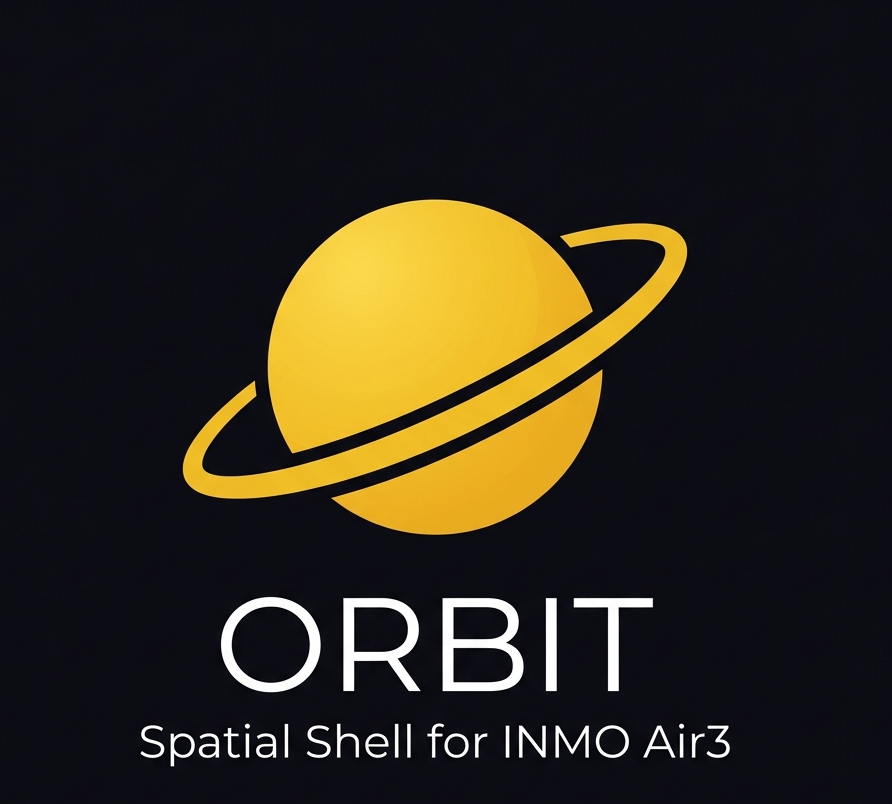

# Orbit — Spatial Desktop Shell for INMO Air3

<div align="center">



[](https://discord.gg/4yB8URK9s)

**The ultimate open, butter-smooth multi-window spatial shell for INMO Air3 AR Smart Glasses.**

[📥 Download APK](#-installation--quick-start) • [✨ Key Features](#-features) • [🎮 Controls](#-controls-cheat-sheet) • [💬 Join Discord](https://discord.gg/4yB8URK9s)

---

</div>

> ⚠️ **Personal Use Disclaimer**  
> This build and its custom modifications are provided strictly for **personal use**. Anyone who chooses to install, run, or modify this release does so entirely **at their own risk and under their own responsibility**.

---

## 🚀 What is Orbit?

**Orbit** replaces INMO's closed, jittery stock "MultiSpace" with a powerful, high-performance GL composited spatial environment that **you control**. Live Android applications float seamlessly as multi-window quads anchored in 3D space around you with sub-pixel precision and ultra-low latency head tracking.

Whether you're multi-tasking with multiple apps floating in your field of view or switching to native ultra-low-power 2D mode on the go, Orbit turns your **INMO Air3 (IMA301)** into a true spatial workstation.

---

## ✨ Features

### 🪐 Dual Spatial Modes
* **Orbit Desktop (`SpacesActivity`)**: A full 3D spatial multi-window environment. Applications run in isolated VirtualDisplays, composited into floating 3D windows around your head.
* **Orbit Grid (`MainActivity`)**: A sleek, flat spatial launcher that opens apps with native 2D display performance and zero composition overhead.

### 🕶️ Advanced Head Tracking (2D / 3D / 6D)
Tailor tracking to your environment straight from the bottom control bar (⚙):
| Mode | How it Works | Best Used For |
| :--- | :--- | :--- |
| **2D** | Windows welded to display. Sensor disabled completely. | Walking, moving vehicles, max battery saving |
| **3D** *(Default)* | Yaw + Pitch tracking with a locked horizon. | Everyday spatial multi-tasking with zero roll-noise |
| **6D** | Full 6-DoF orientation (Yaw + Pitch + Roll). | Lying down or absolute world-locking |

### ⚡ Sub-Pixel Precision & Zero Vibration
* **Draw-Time Pose Extrapolation**: Eliminates motion swim by predicting head pose to exact display scanout timing.
* **Micro-Velocity Ring Buffering**: Smooths out timestamp jitter and eliminates screen shaking.
* **Pixel Snapping**: Locks static windows to physical screen pixels for crystal-clear text readability.

### 🧊 Ice Cold Thermal & Battery Efficiency
Orbit fixes the severe thermal throttling and battery drain of stock launcher software:
* **Background App Freeze**: Background windows are automatically stopped (`STATE_OFF`) and process-frozen via cgroup freezer (0% CPU usage for inactive windows while preserving app state).
* **On-Demand GL Rendering**: Compositor and drawer only repaint when movement or input occurs, dropping idle `SurfaceFlinger` CPU load from **54% down to ~7%** and keeping skin temperatures under **47°C** (no throttling!).
* **Smart Wear-Sensing Timeout**: Detects when glasses are taken off to allow full SoC deep sleep.

### 🎛️ Unified Floating Control Bar
A single, intelligent, auto-hiding bar along the bottom of your field of view puts total control at your fingertips:
* **App Switcher & Quick Drawer**: Instant single-tap switching between running apps.
* **Head-Grab (`✥`)**: Locks a window to your gaze direction—move your head to reposition windows effortlessly.
* **Head-Lock (`🔒`)**: Pins specific windows to your gaze frame of reference.
* **Recenter (`⌖`)**: One-tap spatial recentering of your workspace.
* **Window Controls**: Resize (`−`/`+`), Maximise (`⛶`), Back (`←`), and Close (`✕`).

### 🎮 Samsung Gear VR Controller Support
Orbit drives the Gear VR controller as a full pointer — **the platform cannot do this itself.** The controller carries its HID characteristics under a non-standard GATT service (`0x1879`, not `0x1812`), so Android's `HidHostService` walks straight past it, creates no `uhid` node, and never makes an input device out of it. Orbit talks to it directly over GATT and turns it into a cursor.

* **Touchpad as a trackpad** — thumb movement moves the cursor, with no drift and no calibration.
* **Trigger** = left click and drag · **Pad click** = long press (context menu) · **Back / Home / Volume** work as labelled.
* **Screen-off aware** — the link is dropped when the display sleeps, so a connected controller can't hold the SoC out of suspend.
* **Toggle in Settings → System** — off if you don't own one.

> ⚠️ **Known limitation:** the controller's firmware uses BLE *slave latency*, delivering ~6 samples in a burst every ~90 ms rather than evenly at 66 Hz. This is not configurable from the host — connection-parameter updates are accepted and then ignored by the device. Orbit replays each burst at display rate so movement stays continuous, but roughly 45–90 ms of input latency is imposed by the controller itself and cannot be removed.

### 📸 Orbit Camera — 16MP Stills & 4K Video
Ships with **Orbit Camera**, a purpose-built CameraX camera that unlocks the sensor's full modes. Installed automatically alongside the launcher; the stock INMO camera is replaced and Orbit Camera becomes the system default. **Open Camera is kept installed as a secondary/fallback.**

* **16 MP stills** (4608×3456) — this HAL hides its full-size modes behind `getHighResolutionOutputSizes()`, which ordinary camera apps never call.
* **4K 30 fps video** (3840×2160), with a one-tap **4K ⇄ FHD** switch. FHD is pinned to a constant 30 fps so exposure can't trade frame rate for light.
* **Aspect control** for stills — 4:3 (full sensor, all 15.9 MP), 16:9, 1:1.
* **HDR stills** via the sensor's bracketed-exposure scene mode.
* **Portrait UI** sized to the actual capture area — the camera is mounted rotated 90°, so an upright frame is portrait.

> **Hardware ceilings, measured on the device — these are not settings:**
> * **No 60 fps at any resolution.** The sensor advertises `[10,10] [10,15] [15,15] [24,24] [10,30] [30,30]` and publishes no high-speed video configurations at all.
> * **Video cannot exceed 4096×2160 (8.85 MP).** Both the H.264 and HEVC encoders are capped there, so 16 MP video is impossible on this SoC at any setting.
> * **No HDR video.** `DYNAMIC_RANGE_TEN_BIT` is absent from the camera's capabilities; HDR is stills-only.

### 🖥️ Remote Desktop & Wireless Display
* **Built-in RDP client** (FreeRDP 3.x, arm64) — use a PC desktop as a window inside your space. Off by default; enable in **Settings → System → Remote Desktop**.
* **Miracast sink** — receive a wireless display from Windows.

### 🛠️ Developer & Power Features
* **Fixed Wireless ADB**: Auto-enables ADB on a **fixed port (`5555`)** across reboots, instead of the random port wireless debugging negotiates each session.
* **Automatic MTP Storage**: Keeps USB file transfer alive when plugged into a PC — and verifies something is actually *serving* MTP, not merely that the gadget advertises it.
* **CPU Governor Optimizer**: Removes INMO's frequency clamp, which pins min *and* max to the same value, so the CPU can scale across its full **691 MHz – 1.8 GHz** range instead of being stuck.
* **Stray App Recovery** *(new in 0.2.0)*: Apps started outside Orbit — via ADB, a notification, or an intent chooser — become ordinary tasks the shell has never heard of and vanish from the launcher. Orbit now finds them and adopts them into the space, keeping their state.
* **No Root Required**: Signed with the platform certificate for full framework permission access out of the box.

---

## 🖼️ Screenshots

<div align="center">

| 3D Spatial Workspace | App Launcher Grid | Settings |
| :---: | :---: | :---: |
|  |  |  |

</div>

---

## 📥 Installation & Quick Start

### 1. Download & Install
Grab the latest release APK from the [Releases Page](../../releases) or build from source:

```bash
# Install via ADB
adb install -r -g Orbit.apk

# (Optional, ROOT ONLY) Bypass INMO's first-launch disclaimer.
# Orbit itself needs no root — this one convenience step does.
adb shell su -c 'cmd app_launch_guard add com.j4ckgrey.orbit'

# Launch Orbit Spatial Desktop
adb shell am start -n com.j4ckgrey.orbit/.SpacesActivity
```

---

## 🎮 Controls Cheat Sheet

| Action | How To |
| :--- | :--- |
| **Reveal Control Bar** | Tap or look down toward the bottom edge |
| **Focus / Bring Window Forward** | Tap any window |
| **Move Window** | Click `✥` (Head-Grab), move gaze, click again to drop |
| **Recenter Workspace** | Tap `⌖` on the bottom bar |
| **Toggle App Drawer** | Double-tap empty space or press **Back** |
| **Scroll Inside App** | Swipe or use DPAD / Arrow keys / Scroll wheel |
| **Close Window** | Click `✕` or hold **Back** |
| **Move cursor** *(Gear VR)* | Swipe the controller touchpad |
| **Click / drag** *(Gear VR)* | Trigger |
| **Context menu** *(Gear VR)* | Press the touchpad in |
| **Back / Home / Volume** *(Gear VR)* | The buttons of the same name |

---

## 📋 Requirements

* **INMO Air3 (IMA301)** — Orbit is built against this device's panel, optics and sensors.
* **Platform-signed build** for full functionality. A release-signed APK still runs, but silently loses `ADD_TRUSTED_DISPLAY` (the IME can no longer render inside a window), `INJECT_EVENTS` (touch falls back to a slow shell path), `FORCE_STOP_PACKAGES` and auto-granted `SYSTEM_ALERT_WINDOW`.
* **No root required.**

---

## 📝 Changelog

### 0.2.0
* **Samsung Gear VR controller** as a pointer, with an on/off toggle in Settings → System.
* **Orbit Camera** replaces the patched Open Camera build: 16 MP stills, 4K/FHD switch, stills HDR, aspect control, portrait UI. Bundled with the launcher, replaces the stock INMO camera, becomes the system default. Open Camera is retained as a fallback.
* **Stray App Recovery** — apps started outside Orbit (ADB, notifications, choosers) are found and adopted into the shell instead of vanishing from the launcher.
* Stale launcher components are re-resolved by package, so an app that changes its launch activity on update still opens.
* Cursor pipeline rewritten: bursts from the controller are replayed at display rate, and the pointer filter is retuned for latency rather than for head-tracking stability.

---

## 💬 Community & Support

Our community is growing fast! Whether you have feature requests, feedback, bug reports, or just want to showcase your INMO Air3 setup, join us on Discord!

<div align="center">

### 🗣️ [Join the Orbit Discord Community](https://discord.gg/4yB8URK9s)

*🐞 **Found a bug?** Open an issue on GitHub or drop a line in `#bug-reports` on Discord!*

---

</div>
If you like what I do, consider supporting future development https://ko-fi.com/j4ckgrey

