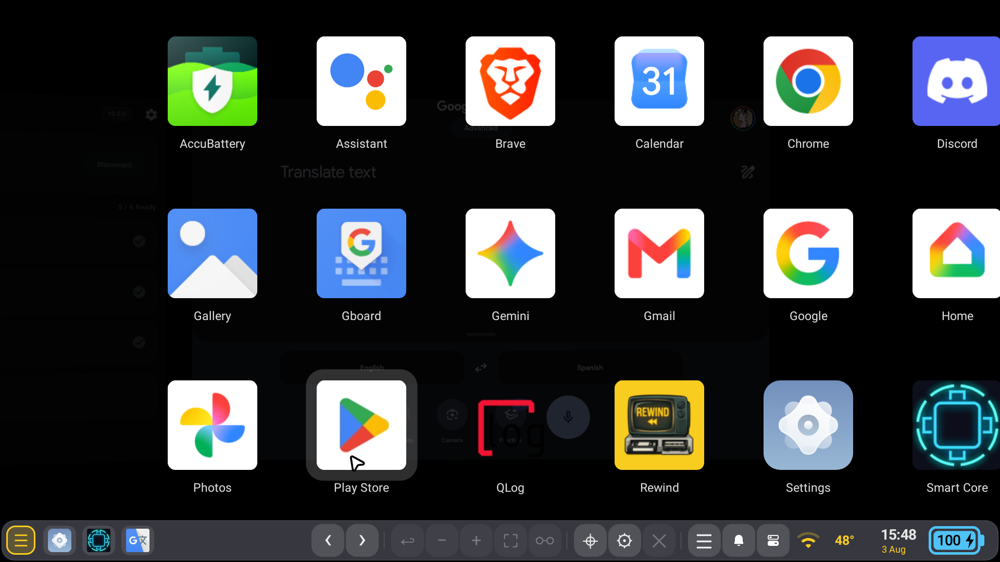
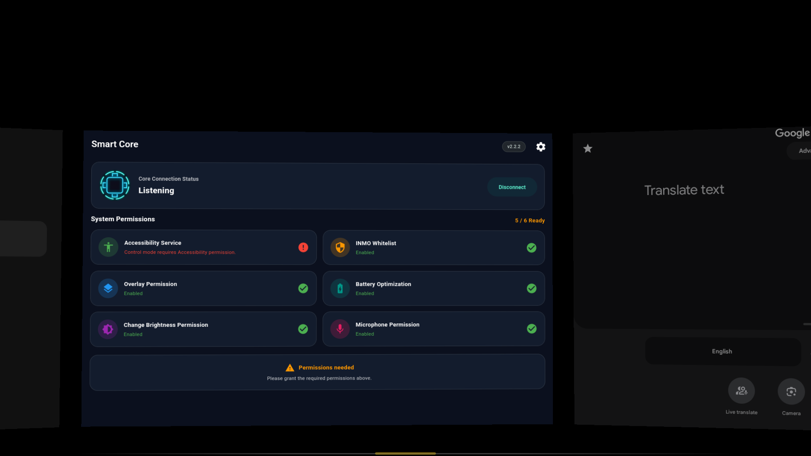
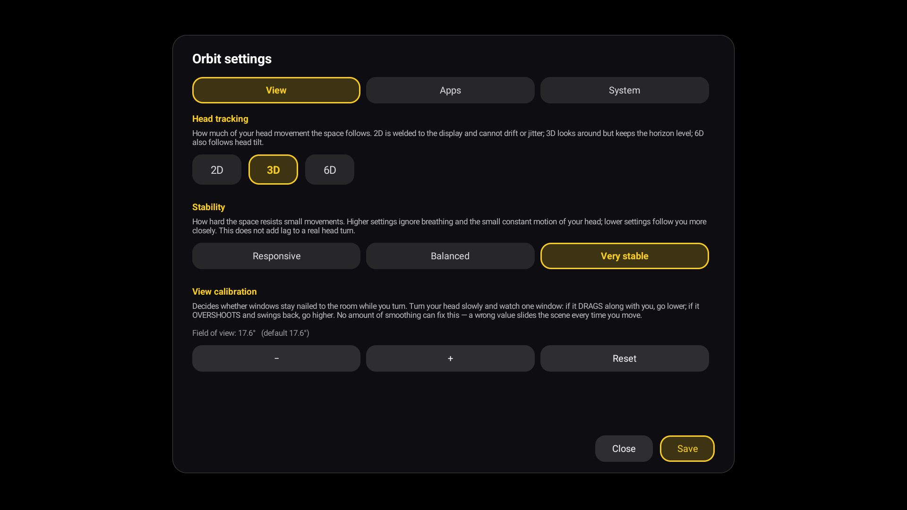

# 🌌 Orbit — Spatial Desktop Shell for INMO Air3

<div align="center">


[](https://discord.gg/4yB8URK9s)

**The ultimate open, butter-smooth multi-window spatial shell for INMO Air3 AR Smart Glasses.**

[📥 Download APK](#-installation--quick-start) • [✨ Key Features](#-features) • [🎮 Controls](#-controls-cheat-sheet) • [💬 Join Discord](https://discord.gg/4yB8URK9s)

---

</div>

## 🚀 What is Orbit?

**Orbit** replaces INMO's closed, jittery stock "MultiSpace" with a powerful, high-performance GL composited spatial environment that **you control**. Live Android applications float seamlessly as multi-window quads anchored in 3D space around you with sub-pixel precision and ultra-low latency head tracking.

Whether you're multi-tasking with multiple apps floating in your field of view or switching to native ultra-low-power 2D mode on the go, Orbit turns your **INMO Air3 (IMA301)** into a true spatial workstation.

---

## ✨ Features

### 🪐 Dual Spatial Modes
* **Orbit Desktop (`SpacesActivity`)**: A full 3D spatial multi-window environment. Applications run in isolated VirtualDisplays, composited into floating 3D windows around your head.
* **Orbit Grid (`MainActivity`)**: A sleek, flat spatial launcher that opens apps with native 2D display performance and zero composition overhead.

### 🕶️ Advanced Head Tracking (2D / 3D / 6D)
Tailor tracking to your environment straight from the bottom control bar (⚙):
| Mode | How it Works | Best Used For |
| :--- | :--- | :--- |
| **2D** | Windows welded to display. Sensor disabled completely. | Walking, moving vehicles, max battery saving |
| **3D** *(Default)* | Yaw + Pitch tracking with a locked horizon. | Everyday spatial multi-tasking with zero roll-noise |
| **6D** | Full 6-DoF orientation (Yaw + Pitch + Roll). | Lying down or absolute world-locking |

### ⚡ Sub-Pixel Precision & Zero Vibration
* **Draw-Time Pose Extrapolation**: Eliminates motion swim by predicting head pose to exact display scanout timing.
* **Micro-Velocity Ring Buffering**: Smooths out timestamp jitter and eliminates screen shaking.
* **Pixel Snapping**: Locks static windows to physical screen pixels for crystal-clear text readability.

### 🧊 Ice Cold Thermal & Battery Efficiency
Orbit fixes the severe thermal throttling and battery drain of stock launcher software:
* **Background App Freeze**: Background windows are automatically stopped (`STATE_OFF`) and process-frozen via cgroup freezer (0% CPU usage for inactive windows while preserving app state).
* **On-Demand GL Rendering**: Compositor and drawer only repaint when movement or input occurs, dropping idle `SurfaceFlinger` CPU load from **54% down to ~7%** and keeping skin temperatures under **47°C** (no throttling!).
* **Smart Wear-Sensing Timeout**: Detects when glasses are taken off to allow full SoC deep sleep.

### 🎛️ Unified Floating Control Bar
A single, intelligent, auto-hiding bar along the bottom of your field of view puts total control at your fingertips:
* **App Switcher & Quick Drawer**: Instant single-tap switching between running apps.
* **Head-Grab (`✥`)**: Locks a window to your gaze direction—move your head to reposition windows effortlessly.
* **Head-Lock (`🔒`)**: Pins specific windows to your gaze frame of reference.
* **Recenter (`⌖`)**: One-tap spatial recentering of your workspace.
* **Window Controls**: Resize (`−`/`+`), Maximise (`⛶`), Back (`←`), and Close (`✕`).

### 📸 Unlocked 4K & 16MP Camera Integration
Includes seamless setup for patched Open Camera binaries, bypassing stock limits to unlock full 16MP photos (4608x3456) and 4K 30fps video recording on the INMO Air3 sensor.

### 🛠️ Developer & Power Features
* **Fixed Wireless ADB**: Auto-enables Wireless ADB on a fixed port (`5555`) across reboots.
* **Automatic MTP Storage**: Keeps USB file transfer active when plugged into a PC.
* **CPU Governor Optimizer**: Fixes INMO CPU frequency caps to allow dynamic boosting up to 2.2 GHz when needed.
* **No Root Required**: Signed with platform certs for full framework permission access out of the box.

---

## 🖼️ Screenshots

<div align="center">

| 3D Spatial Workspace | App Launcher Grid | Command Bar & Settings |
| :---: | :---: | :---: |
|  |  |  |

</div>

---

## 📥 Installation & Quick Start

### 1. Download & Install
Grab the latest release APK from the [Releases Page](../../releases) or build from source:

```bash
# Install via ADB
adb install -r -g Orbit.apk

# (Optional) Bypass INMO first-launch disclaimer
adb shell su -c 'cmd app_launch_guard add com.j4ckgrey.orbit'

# Launch Orbit Spatial Desktop
adb shell am start -n com.j4ckgrey.orbit/.SpacesActivity
```

---

## 🎮 Controls Cheat Sheet

| Action | How To |
| :--- | :--- |
| **Reveal Control Bar** | Tap or look down toward the bottom edge |
| **Focus / Bring Window Forward** | Tap any window |
| **Move Window** | Click `✥` (Head-Grab), move gaze, click again to drop |
| **Recenter Workspace** | Tap `⌖` on the bottom bar |
| **Toggle App Drawer** | Double-tap empty space or press **Back** |
| **Scroll Inside App** | Swipe or use DPAD / Arrow keys / Scroll wheel |
| **Close Window** | Click `✕` or hold **Back** |

---

## 💬 Community & Support

Our community is growing fast! Whether you have feature requests, feedback, bug reports, or just want to showcase your INMO Air3 setup, join us on Discord!

<div align="center">

### 🗣️ [Join the Orbit Discord Community](https://discord.gg/4yB8URK9s)

*🐞 **Found a bug?** Open an issue on GitHub or drop a line in `#bug-reports` on Discord!*

---

**Made with ❤️ for the AR Community**
</div>
